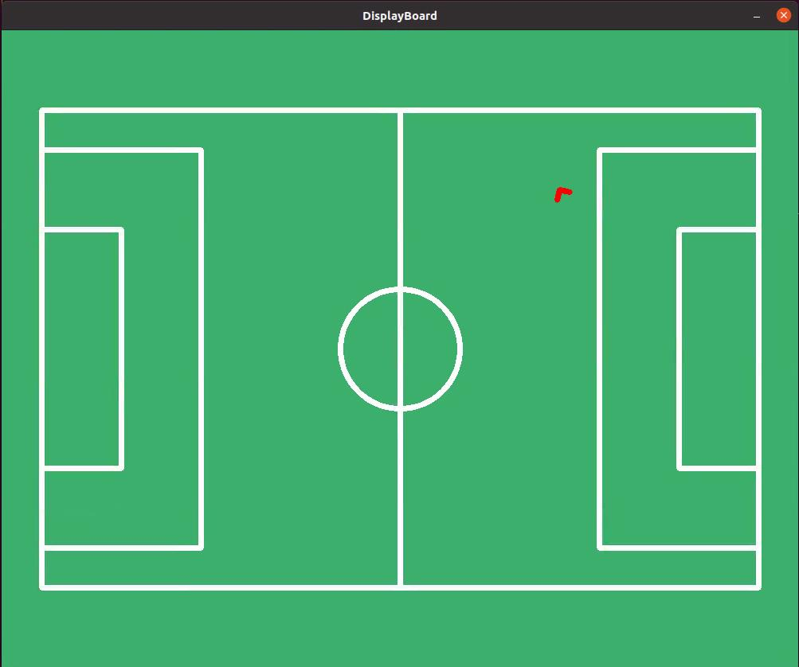

# RoboCup Locator v1.0

# Introduction
This project is a robocup location demo module for unitree robots.
According to the various features(T-shaped corners, L-shaped corners, X-shaped corners, etc.) of the field, it calculate the position of the robot in real time.




# Prerequisites

## 1. OpenCV

```
wget https://github.com/opencv/opencv/archive/refs/tags/4.11.0.zip -O opencv.zip
unzip opencv.zip && cd opencv
mkdir build && cd build
cmake ..
make -j4
sudo make install
```

## 2. Eigen    6666

```
wget https://gitlab.com/libeigen/eigen/-/archive/3.4.0/eigen-3.4.0.zip 
unzip eigen-3.4.0.zip && eigen-3.4.0
mkdir build && cd build
cmake ..
sudo make install
```

## 3. unitree_sdk2
Refer to https://github.com/unitreerobotics/unitree_sdk2.git

## 4. yaml-cpp

```
sudo apt install libyaml-cpp-dev
```


# Installation

```
mkdir build && cd build
cmake ..
make -j4
```

After compiling, two executable files will be generated in the current directory.

Excution method:

> .\test_location [NetworkInterface] [config_file] [EnableVisualization]

For example:

> .\test_location eth0 ../config.yaml 1


# Data Communication

## Subscribe
This program needs to subscribe to the following topics:
1. Detection results (detectionresults)

Run the program in `football_detect_cpp`:
```
./football_detect eth0 1
```
2. Servo State data (rt/g1_comp_servo/state)

Run the program in `g1_comp_servo_service`:
```
sudo ./main eth0
```

3. Low State data (rt/lowstate)
4. Odometry data (rt/lf/odommodestate)

## Publish
This program publishes topic `LocationModule::LocationResult`.

```
struct LocationResult {
   float robot2field_x;
   float robot2field_y;
   float robot2field_theta;
}
```

Refer to `test_subscribe_location.cpp` for how to subscribe this topic.

# Coordinate Definition
1. Origin (0,0): In the center of the field
2. X-axis:
   - Positive direction points to the opponent's goal
   - Negative direction points to the own goal
3. Y-axis:
   - Positive direction points to the left
   - Negative direction points to the right
4. Angle θ:
   - Aligned with the positive direction of the X-axis is 0 degree, counterclockwise is positive, and clockwise is negative


