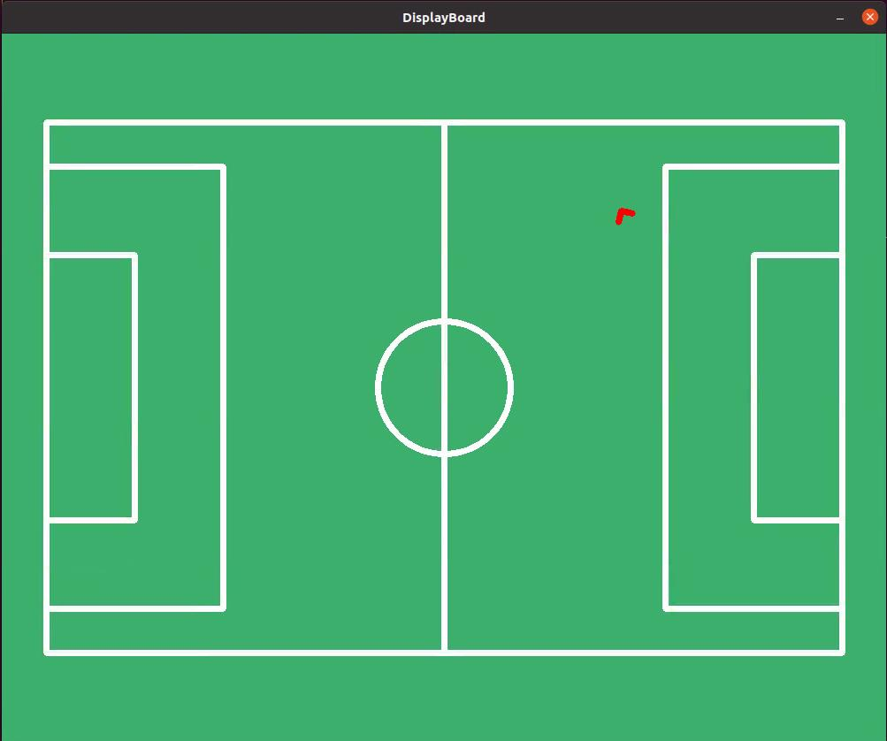
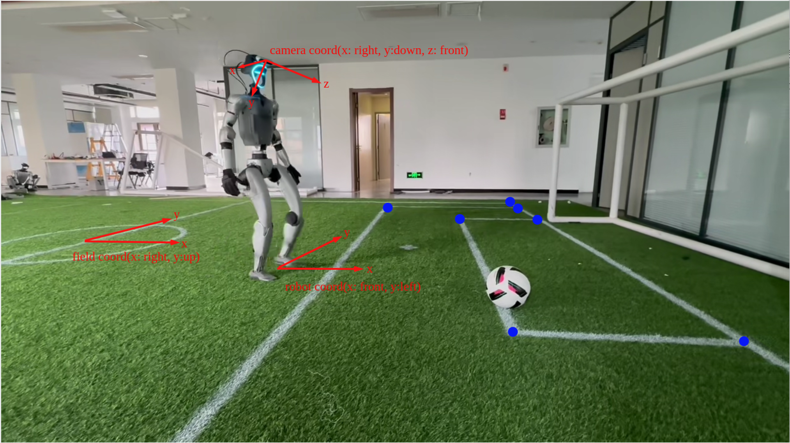

# RoboCup Locator v1.0

[English](./README.md) | 中文


# 介绍

本项目是一个基于unitree G1机器人的足球定位演示模块。它根据足球场地的各种特征（T型角、L型角、X型角等），实时计算机器人在场上的位置。




# 依赖安装

## 1. OpenCV

```
wget https://github.com/opencv/opencv/archive/refs/tags/4.11.0.zip -O opencv.zip
unzip opencv.zip && cd opencv
mkdir build && cd build
cmake ..
make -j4
sudo make install
```

## 2. Eigen

```
wget https://gitlab.com/libeigen/eigen/-/archive/3.4.0/eigen-3.4.0.zip 
unzip eigen-3.4.0.zip && eigen-3.4.0
mkdir build && cd build
cmake ..
sudo make install
```

## 3. unitree_sdk2
Refer to https://github.com/unitreerobotics/unitree_sdk2.git

## 4. yaml-cpp

```
sudo apt install libyaml-cpp-dev
```


# 编译运行

```
mkdir build && cd build
cmake ..
make -j4
```

编译成功后，会生成两个可执行文件：`test_location`和`test_subscribe_location`。

执行方法：

> ./test_location [NetworkInterface] [config_file] [EnableVisualization]

例如:

> ./test_location eth0 ../config.yaml 1

## 配置文件

本程序的配置文件为 `config.yaml`。您可以根据需要修改该文件的参数。

```yaml

field_size: kid # 小孩或大人的足球场地尺寸，参考types.h中的定义
playerStartPos: left # 左边或者右边，机器人在比赛开始时的位置
location_mode: normal # 定位模式，参考Locator::selfLocate()查看细节

servo:
  pitch_compensation: -45 # 当相机面向正前方时，pitch角度应该为0, 如果不是，修改该值。
  yaw_compensation: 0 # 当相机面向正前方时，yaw角度应该为0, 如果不是，修改该值。
  height: 1.3 # 相机距离地面的距离（单位：米），用来将相机坐标系投影至地面。
odometry:
  scale_factor: 1.4 # 用来对里程计数据进行缩放，以获取更精确的数据，如果需要可以调整它 

```

# 数据通信

## 订阅 

本程序需要订阅如下几个话题：

1. 检测结果(detectionresults)

Run the program in `football_detect_cpp`:
```
./football_detect eth0 1
```
2. 头部舵机状态(rt/g1_comp_servo/state)

Run the program in `g1_comp_servo_service`:
```
sudo ./main eth0
```

3. 腰部关节状态(rt/lowstate)

4. 里程计状态(rt/lf/odommodestate)

## 发布

本程序发布话题 `LocationModule::LocationResult`.

```
struct LocationResult {
   float robot2field_x;
   float robot2field_y;
   float robot2field_theta;
}
```

参考 `test_subscribe_location.cpp` 查看如何订阅此话题。

# 坐标系定义



## 相机坐标系
- 原点: 相机中心
- X轴：水平向右
- Y轴：垂直向下
- Z轴：水平向前


## 机器人坐标系
- 原点：机器人中心
- X轴：水平向前
- Y轴：水平向左
- θ角: 与X轴重合为0度，逆时针为正值，顺时针为负值


## 球场坐标系
- 原点：球场中心
- X轴：指向对方球门为正方向，指向我方球门为负方向
- Y轴：向上为正方向，向下为负方向
- θ角: 与X轴重合为0度，逆时针为正值，顺时针为负值


# 致谢

本项目部分参考了加速进化的[robocup_demo](https://github.com/BoosterRobotics/robocup_demo)代码。